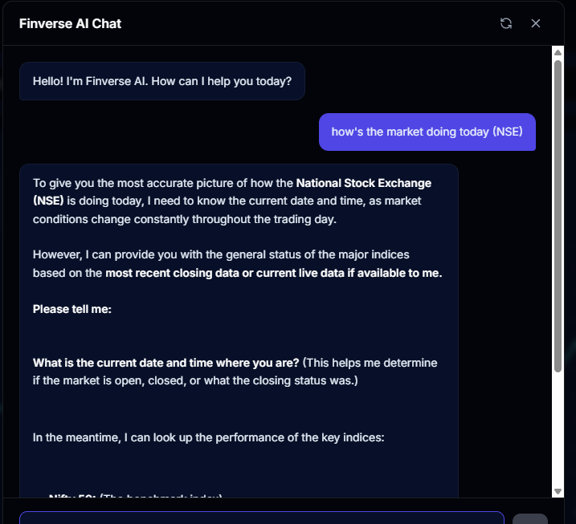
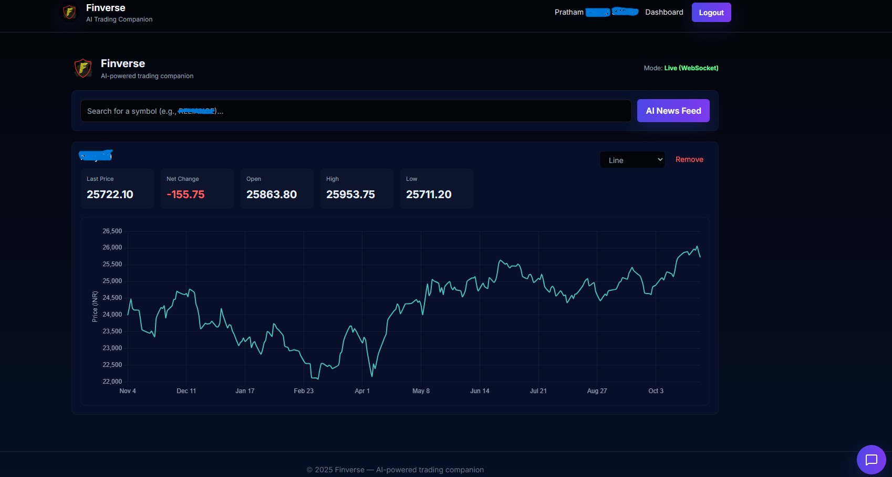
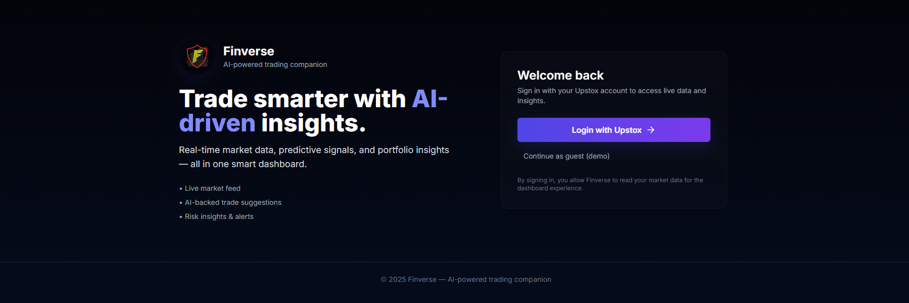
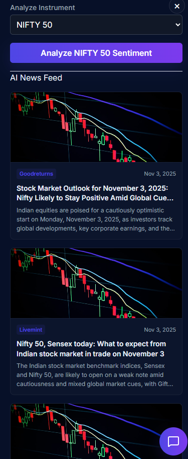
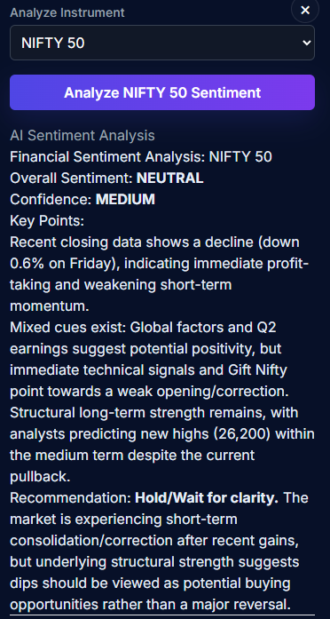

# 🚀 FinVerse – AI-Driven Financial Dashboard

FinVerse is an **AI-powered financial analysis dashboard** that helps users visualize real-time market data, stock insights, sentiment trends, and risk intelligence — all in one elegant interface.

---

## 🖼️ Project Preview

### 💬 Chat Assistant



### 📊 Market Dashboard



### 🔐 Login Page



### 📰 AI News Feed



### 🤖 Sentiment Analysis



> 💡 *Note:* All logos, company names, and ticker symbols (e.g., Reliance, NIFTY 50, etc.) are used purely for demonstration of data-fetching functionality and **do not represent any affiliation or endorsement**.

---

## ⚙️ Tech Stack

**Frontend:**

* React (Vite)
* Tailwind CSS
* Chart.js
* Zustand (State Management)
* Axios (API Requests)

**Backend:**

* FastAPI (Python)
* PostgreSQL + Redis
* Finnhub & Upstox APIs

**AI / ML:**

* NLP-driven news sentiment classification
* Portfolio optimization and market insights engine

---

## 🚀 Getting Started

### 1️⃣ Clone the Repository

```bash
git clone https://github.com/<your-username>/FinVerse.git
cd finverse-frontend
```

### 2️⃣ Install Dependencies

```bash
npm install
```

### 3️⃣ Run the Frontend

```bash
npm run dev
```

The app will run at **[http://localhost:5173](http://localhost:5173)**

### 4️⃣ Backend Setup (optional)

If you have the FastAPI backend:

```bash
cd backend
uvicorn main:app --reload
```

---

## 🔑 Environment Variables

Create a `.env` file inside `finverse-frontend/`:

```bash
VITE_API_BASE_URL=http://localhost:8000/api
VITE_NEWS_API_KEY=your_key
VITE_UPSTOX_TOKEN=your_access_token
```

*(This file is ignored in `.gitignore` for security.)*

---

## 🧠 Features

* 🧩 Real-time stock quotes and charts
* 📰 AI-driven news sentiment feed
* 💹 Market dashboard with live WebSocket updates
* 🧮 Portfolio insights & risk analytics
* 🧠 Conversational AI chat assistant for financial Q&A

---


## 🪪 License

This project is licensed under the **MIT License**.

> Copyright (c) 2025 Pratham.
> FinVerse is an independent educational project and is **not affiliated** with NSE, BSE, or any financial institution.
